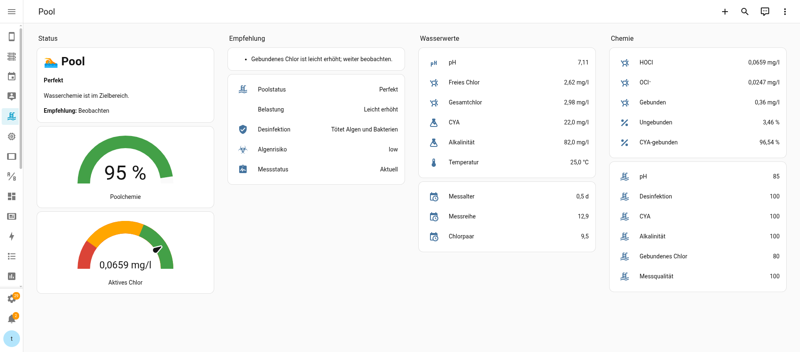

# Pool Assistant for Home Assistant

Pool Assistant is a Home Assistant custom integration for pool water analysis.
It turns existing manual water measurements into calculated chemistry values,
status sensors and practical recommendations.

The integration is designed as an assistant, not as an automatic pool
controller. It does not dose chemicals by itself and it does not replace
responsible pool maintenance. Measurements can come from PoolLab or any other
Home Assistant sensors that provide the required values.



## What It Does

Pool Assistant evaluates pool water from the actual chemistry relationships
between pH, free chlorine, cyanuric acid and temperature.

Instead of only showing:

```text
Free chlorine: 2.6 mg/l
```

it calculates values such as:

```text
Active chlorine HOCl: 0.0659 mg/l
Disinfection status: effective
Pool chemistry index: 95 %
Recommendation: observe
```

## Features

- Calculates active chlorine as `HOCl`
- Calculates `OCl⁻`, unbound chlorine and CYA-bound chlorine
- Shows chlorine/cyanurate species percentages
- Calculates combined chlorine from free and total chlorine
- Detects implausible chlorine measurements
- Tracks measurement age and synchronization
- Assesses chemical algae risk
- Assesses bound chlorine load separately from algae risk
- Calculates a project-specific pool chemistry index
- Provides human-readable recommendations
- Supports optional temperature input, otherwise falls back to `25 °C`
- Supports configurable pool volume for later dosing features

## How It Works

The chemistry model is based on the O'Brien/USEPA free chlorine and cyanuric
acid equilibrium model documented by the USEPA simulator.

Inputs:

- pH
- free chlorine
- total chlorine
- cyanuric acid
- alkalinity
- optional temperature
- pool volume

Calculated outputs:

- active chlorine `HOCl`
- hypochlorite `OCl⁻`
- unbound chlorine percentage
- CYA-bound chlorine percentage
- chlorine/cyanurate species percentages
- bound chlorine
- disinfection status
- chemical algae risk
- load status
- pool chemistry index
- pool status
- recommendation

The cyanuric-acid equilibrium constants currently use the O'Brien/USEPA
constants for `25 °C`. The `HOCl`/`OCl⁻` pKa is temperature-adjusted.

See [`docs/pool-water-chemistry.md`](docs/pool-water-chemistry.md) for the
chemistry background, working thresholds and assessment rationale.

## Important Scope

Pool Assistant is intentionally conservative:

- It does not claim to reproduce the internal PoolLab app model unless that can
  be proven.
- It does not use Redox/ORP as a dosing proxy.
- It does not automatically dose chemicals.
- It blocks recommendations when measurements are stale, unsynchronized or
  chemically implausible.
- It treats the pool chemistry index as a project-specific score, not as a
  scientific health metric.

## Installation

### HACS

1. Open HACS in Home Assistant.
2. Add this repository as a custom repository:

   ```text
   thmsck/home-assistant-pool-assistant
   ```

3. Select category `Integration`.
4. Install `Pool Assistant`.
5. Restart Home Assistant.
6. Add the integration via:

   ```text
   Settings → Devices & services → Add integration → Pool Assistant
   ```

### Manual Installation

Copy the integration directory into your Home Assistant config:

```text
custom_components/pool_assistant
```

Resulting structure:

```text
config/
└── custom_components/
    └── pool_assistant/
        ├── __init__.py
        ├── manifest.json
        ├── config_flow.py
        ├── sensor.py
        └── ...
```

Then restart Home Assistant and add the integration from the UI.

## Configuration

During setup, select:

1. Name
2. Pool volume in m³
3. pH sensor
4. Free chlorine sensor
5. Total chlorine sensor
6. Cyanuric acid sensor
7. Alkalinity sensor
8. Temperature sensor, optional

If no temperature sensor is selected, Pool Assistant uses `25 °C`.

Example source entities:

```text
sensor.out_garden_meter_pool_water_ph
sensor.out_garden_meter_pool_water_free_chlorine
sensor.out_garden_meter_pool_water_total_chlorine
sensor.out_garden_meter_pool_water_cyanuric_acid
sensor.out_garden_meter_pool_water_total_alkalinity
sensor.out_garden_meter_pool_water_temperature
```

## Measurement Timestamps

Pool Assistant can evaluate whether measurements belong together. For best
results, source sensors should expose a `measured_at` attribute.

Example:

```yaml
attributes:
  measured_at: "2026-07-01 11:30:18"
```

If `measured_at` is missing, Home Assistant's entity `last_updated` timestamp is
used.

## Sensors

The integration creates a separate Pool Assistant device with these sensors:

| Sensor | Meaning |
| --- | --- |
| `Aktives Chlor HOCl` | Calculated active chlorine in mg/l |
| `Hypochlorit OCl` | Calculated hypochlorite in mg/l |
| `Gebundenes Chlor` | Total chlorine minus free chlorine |
| `Ungebundenes Chlor` | HOCl + OCl⁻ percentage |
| `An CYA gebundenes Chlor` | Chlorine reversibly bound by cyanuric acid |
| `Chlor-Spezies` | Detailed chlorine/cyanurate species percentages |
| `Desinfektionsstatus` | `critical`, `limited` or `effective` |
| `Messalter` | Age and time span of source measurements |
| `Messstatus` | `current`, `unsynced`, `stale` or `unknown` |
| `Belastungsstatus` | Bound-chlorine load status |
| `Algenrisiko` | Chemical algae risk |
| `Poolchemie-Index` | Project-specific chemistry score from 0-100 % |
| `Poolstatus` | Human-readable overall status |
| `Handlungsempfehlung` | Recommended next action |

## Example Dashboard

The screenshot above shows a compact dashboard built from standard Home
Assistant cards. It is not installed automatically, but can be recreated from
the generated sensors.

Recommended layout:

- Status and recommendation
- Pool chemistry index gauge
- Active chlorine `HOCl` gauge with red/yellow/green thresholds
- Current source measurements
- Calculated chemistry values
- Scores and measurement quality

## Validation Case

Reference case from PoolLab screenshots:

- pH: `6.9`
- free chlorine: `3.0 mg/l`
- CYA: `140 mg/l`
- temperature: `26 °C`

Expected output:

- HOCl: about `0.0126 mg/l`
- unbound chlorine: about `0.52 %`
- CYA-bound chlorine: about `99.48 %`

## Development

Install test dependencies in your preferred Python environment, then run:

```bash
python3 -m pytest
```

Validate syntax:

```bash
python3 -m py_compile custom_components/pool_assistant/*.py
```

For local SSHFS-based Home Assistant config mounts, deploy with:

```bash
scripts/deploy-local.sh ../ha-config
```

Home Assistant must be restarted after changing integration Python files.

## Roadmap

Planned or possible next steps:

- Dosing recommendation for liquid chlorine
- pH-minus recommendation
- Maintenance reminders
- ntfy notifications
- InfluxDB-based seasonal analysis
- Optional PV-aware pump/runtime recommendations
- Optional dosing pump support based on real measurements

## Disclaimer

Pool Assistant provides calculated guidance from sensor data. Always verify
measurements and follow chemical manufacturer instructions, local regulations
and common pool safety practices.
